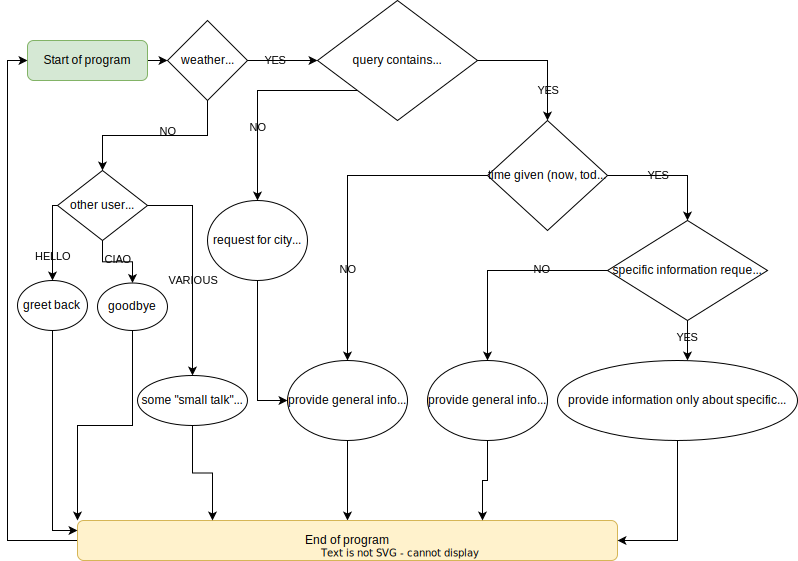

# weatherchatbot
## Project: AI Use Case assignment

In this project a chatbot for weather forecast is implemented. 

- **Use case**: The (fictitious) use case is identified as follows: In the touristic country Austria, a well-known weather channel decided to implement a web-integrated English chatbot, which is able to provide current weather information, forecast for today and tomorrow for the nine capitals of the states of Austria: Bregenz, Innsbruck, Salzburg, Klagenfurt, St.Pölten, Graz, Linz, Vienna and Eisenstadt. This project (use case) is limited to the capitals only, ¨
since the weather channel wants to evaluate the functionality of the chatbot first, before providing more resources for a possible future extension.
- **Functionalities**: The chatbot needs to be able to provide weather information for each of the nine cities for the current conditions, the forecast for today and the forecast for tomorrow. The user can ask for general weather information about each city, where the most important characteristics (temperature, sky condition and wind speed) are summarized. Nevertheless, also more specific information can be requested, such as air pressure, wind speed, UV index etc. Besides the weather information the chatbot also needs to be capable to say ”hello” and ”bye” to the customer and also to show some ”small talk” capabilities in order to provide a more realistic experience, such as providing answers to ”How are you?”, ”What are your capabilities?” or ”What are you?”.
- **Communication and boundaries**: In order to have a good user interface for communication with the chatbot, a web integration of the chatbot is desired. To keep the project within boundaries, a local host for running the web integration and no external database or APIs to retrieve up-to-date real data are used. Therefore, static and fictitious weather data is used.
- **Framework**: For the framework, it has been decided to use RASA. The main reasons for choosing RASA are as follows: It is an open-source Python (prior experience by the author) implementation for bot creation, provides good documentation, has a broad community for helping with bug-fixes/problems and is also used by big enterprises, therefore represents state of the art technology for chatbot implementations. Last but not least, it also provides useful tools for web integration. Other frameworks used: Anaconda Distribution (python package and environment management), PyCharm (IDE for programming) and Github (version control).

**Conversation flowchart of the weather forecast chatbot:**

